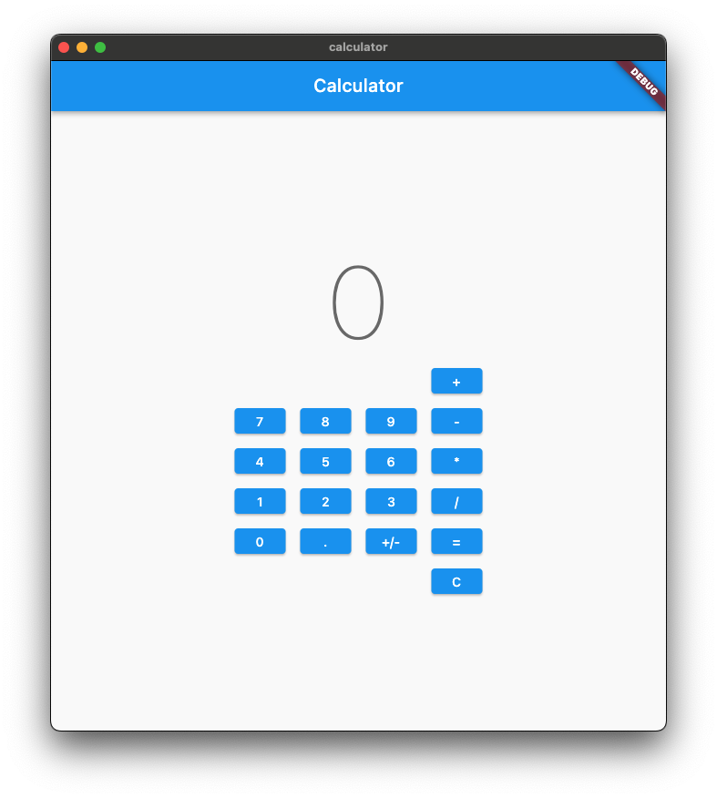

# Basic Calculator

The goal of this exercise is to create a basic calculator that can add, subtract, multiply, and divide two numbers.

Here are the acceptance criteria:

1. The app should have a display that shows the current number
2. The app should have a keypad with the following buttons:

- 0-9
- +, -, \*, /
- =
- +/- (change sign)
- C (clear)

3. The app should be able to perform the following operations:

- Addition
- Subtraction
- Multiplication
- Division
- Clear

4. The app should be able to clear the current calculation and start a new one at any time
5. The app should be able to perform operations with decimal numbers
6. The app should be able to perform operations with negative numbers
7. The app should be able to perform operations with numbers greater than 9

## Tests

Please try add tests for each acceptance criteria and all methods you add to your cubit.
You can find the tests in the `tests` directory.

After testing the business logic (cubit) it is recommended to test the UI as well.
Add them to `calculator_test.dart`.

## Tips

- Start with integer numbers and then add decimal numbers and negative numbers.
- Start with addition and then add the other operations.
- Take a moment to think about the different states your calculator can have. These will likely be fields in your state object.
- Take a moment to think about the different events your calculator can handle. These will likely be the methods of the cubit.
- Take a moment to think about the different transitions your calculator can make. These will likely be the logic inside of your methods.

## Bonus

8. The app should be able to perform multiple operations at once (e.g. 1 + 2 + 3 = 6)
9. The app should be able to handle multiple operations in one calculation, such as (2+3)\*4.
10. The app should be able to handle order of operations correctly. (e.g. 2 + 3 \* 4 = 14, not 20)

11. The app should have a history of all calculations performed
